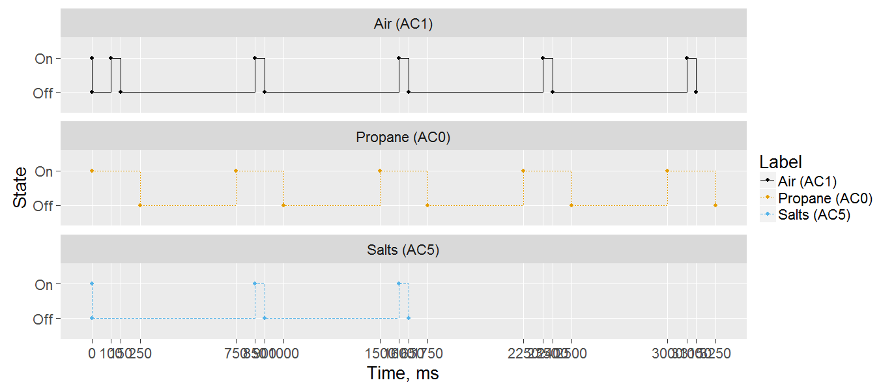

# Solenoids

This toolchain is designed to ease detailed control of mulitiple solenoid timing.  Code is loaded the uC to control the exact timings, and a GUI is provided to set up the timings.  A serial connection is used between the UI and the uC.

## Arduino Code

* Load *src/test_serial* to the Arduino Mega, taking care to adjust the pinout to match.
* Confirm upload by opening a serial connection and verify response from uC.  Note the serial port for later use.

## User Interface Code

* download and install *R*.
* run *UI/RUN_ME.R* to set up packages (may need to run that multiple times until dependencies are satisfied).

### Ports tab

* *Select active ports*: select from a list of available ports
* *Set port names*: optional, but downstream displays will show this human-readble alias.
* *Serial connection*: open a serial connection the uC.

### Timings tab

* *Define Timings*
    * *On Interval*: duration, in milliseconds, for which the solenoid will be open per cycle.
    * *Off Interval*: duration, in milliseconds, for which the solenoid will be closed per cycle.
    * *Start*: delay, in milliseconds, before the first active solenoid cycle.
    * *Number of Cycles*: number of repeated cycles to perform.

* *Visualize Timings* offers a graphical representation through time for the solenoid states.  For example:
    * Three solenoids (AC0="Propane", AC1="Air", AC2="Salts") are defined.
    * "Propane" is instructed to open for 250 ms and close for 500 ms, for four cycles and no delayed start.
	* "Air" is instruvted to open for 50 mg and close for 700 mg, for for cycles and a 100 mg delayed start.  Thus, "Air" is in-phase with "Propane" and will open and close in the middle of "Propane" open.
	* "Salts" is instructed to open as "Air", but for two cycles and a 900 ms delay.  Thus, "Salts" is in-phase with "Air", but only opens during the middle two openings of "Air" and "Propane".

### Firing tab

* various actions to query, set, and execute solenoid timings on the uC.

