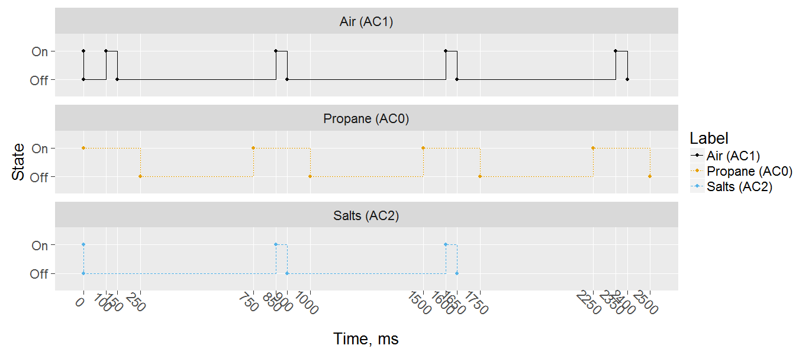

# Solenoids

This toolchain is designed to ease detailed control of mulitiple solenoid timing.  

## Arduino Code

* Load *src/test_serial* to the Arduino Mega, taking care to adjust the pinout to match.
* Confirm upload by opening a serial connection and verify response from uC.

## User Interface Code

* download and install *R*.
* run *UI/RUN_ME.R* to set up packages (may need to run that multiple times until dependencies are satisfied*.

### Ports tab

* *Select active ports*: select from a list of available ports
* *Set port names*: optional, but downstream displays will show this human-readble alias.
* *Serial connection*: open a serial connection the uC.

### Timings tab

* *Define Timings*
    * *On Interval*: duration, in milliseconds, for which the solenoid will be open per cycle.
    * *Off Interval*: duration, in milliseconds, for which the solenoid will be closed per cycle.
    * *Start*: delay, in milliseconds, before the first active solenoid cycle.
    * *Number of Cycles*: number of repeated cycles to perform.

* *Visualize Timings* offers a graphical representation through time for the solenoid states.

### Firing tab

* various actions to query, set, and execute solenoid timings on the uC.

